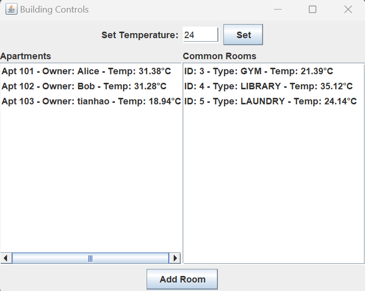

# Apartment Building Temperature Control System

A Java Swing application for managing temperature control in an apartment building.



## Project Structure

```
ApartmentBuilding/
├── src/main/java/
│   ├── models/
│   │   ├── Room.java          # Base class for all rooms
│   │   ├── Apartment.java     # Apartment implementation
│   │   ├── CommonRoom.java    # Common area implementation
│   │   └── Building.java      # Main building management
│   ├── gui/
│   │   └── BuildingGUI.java   # Graphical user interface
│   ├── utils/
│   │   └── PropertyLoader.java # Configuration utilities
│   └── Main.java              # Application entry point
├── src/main/resources/
│   └── application.properties  # Application configuration
├── build.gradle               # Gradle build configuration
├── Dockerfile                 # Docker configuration
├── run-app.sh                 # Platform-specific run script
├── gradlew                    # Gradle wrapper script
├── apartment-building.jar    # Built JAR file
└── README.md                  # This file
```

## Features

- Real-time temperature monitoring
- Individual room temperature control
- Support for apartments and common areas
- Automatic temperature adjustment
- User-friendly graphical interface

## Implementation Assumptions

1. **User Interface Implementation**
   - Based on the requirement for user input (setpoint and room addition), the application implements a graphical user interface using Java Swing library
   - GUI provides intuitive controls for temperature management and room addition

2. **Temperature Control Mechanism**
   - Temperature changes occur gradually at a fixed rate of 0.1°C per second
   - This simulates realistic heating/cooling behavior in physical rooms

3. **Temperature Monitoring**
   - A scheduler runs every 10 seconds to check each room's temperature
   - Automatically adjusts heating/cooling based on current conditions

4. **Temperature Threshold**
   - "Close enough" is defined as ±1°C from the requested temperature
   - When room temperature is within this threshold, both heating and cooling are disabled

5. **Apartment Numbering System**
   - Apartments are numbered starting from 101, incrementing by 1 (101, 102, etc.)
   - Each apartment requires an owner name, which is separate from the apartment number
   - Apartment numbers are automatically assigned while owner names are user-provided

6. **Development Process**
   - Feature development followed Git branch workflow
   - Each feature was developed in a separate branch
   - Changes were reviewed through pull requests before merging
   - Pull request history available for feature development tracking

7. **Containerization**
   - Application is containerized using Docker
   - Assumes Docker is installed and running on the host system
   - Provides platform-specific run scripts for easy deployment

8. **Build System**
   - Uses Gradle as the build tool
   - Provides both build.gradle and Gradle wrapper for consistent builds

## Potential Improvements

1. **Room Management**
   - Current implementation only supports adding rooms
   - Future improvement: Implement room removal functionality
   - Consider adding room modification capabilities (e.g., changing owner names)

2. **GUI Enhancements**
   - Current GUI shows temperature changes but not explicit heater/cooler status
   - Future improvement: Add visual indicators for heating/cooling status
   - Consider adding graphical representation of temperature trends
   - Potential for more detailed room status display

## Running the Application

There are three ways to run this application, listed from simplest to most complex:

### Method 1: Direct JAR Execution (Simplest)

**Prerequisites:**
- Java 17 or later installed

**Steps:**
1. Clone the repository:
```bash
git clone https://github.com/tianhao-ai/ApartmentBuilding.git
cd apartment-building
```
2. Run the application:
```bash
java -jar apartment-building.jar
```

### Method 2: Using Docker (Recommended for Consistent Environment)

**Prerequisites:**
- Docker installed and running
- X11 server except for Linux user

**Platform-Specific Instructions:**

#### Linux
1. Run:
```bash
chmod +x run-app.sh
./run-app.sh
```

#### macOS
1. Install XQuartz:
```bash
brew install --cask xquartz
```

2. Configure XQuartz properly:
   - Start XQuartz (from Applications/Utilities or using Spotlight)
   - Open XQuartz Preferences (⌘+,)
   - Go to the "Security" tab
   - Uncheck "Authenticate connections"
   - Check "Allow connections from network clients"
   - Close Preferences
   - Restart XQuartz for changes to take effect

3. If you encounter "cannot connect to X11 window server" error:
   - Make sure you've completed step 2 above
   - Quit XQuartz completely (⌘+Q)
   - Wait a few seconds
   - Start XQuartz again
   - Try running the application again

4. Run:
```bash
chmod +x run-app.sh
./run-app.sh
```

#### Windows
1. Install VcXsrv Windows X Server:
   - Download from: https://sourceforge.net/projects/vcxsrv/
   - Install with default settings

2. Start XLaunch (VcXsrv) with these settings:
   - Multiple windows
   - Display number: 0
   - Start no client
   - Disable access control (check the box)

3. Install Git Bash if not already installed
   - Download from: https://git-scm.com/download/win
   - During installation, select "Use MinTTY" option

4. Run:
```bash
chmod +x run-app.sh
./run-app.sh
```

### Method 3: Building from Source (For Developers)

**Prerequisites:**
- JDK 17 or later installed
- Git installed

**Steps:**
1. Clone the repository:
```bash
git clone https://github.com/tianhao-ai/ApartmentBuilding.git
cd apartment-building
```

2. Build the project:
```bash
./gradlew clean build
```

3. Run the built application:
```bash
java -jar build/libs/apartment-building.jar
```

## Troubleshooting Common Issues


### Java Version Issues
```bash
# Check Java version
java -version
```
Make sure you have Java 17 or later installed.

### Permission Issues
If you encounter permission denied errors:
```bash
# Make scripts executable
chmod +x gradlew
chmod +x run-app.sh
```

## Acknowledgements

This application was developed as part of the hiring process at [Conserve IT](https://www.conserveit.com.au/). Special thanks to the Conserve IT team for their support, guidance, and the opportunity to work on this project. The project demonstrates practical applications of building automation and temperature control systems, which aligns with Conserve IT's expertise in building management and energy conservation solutions.
